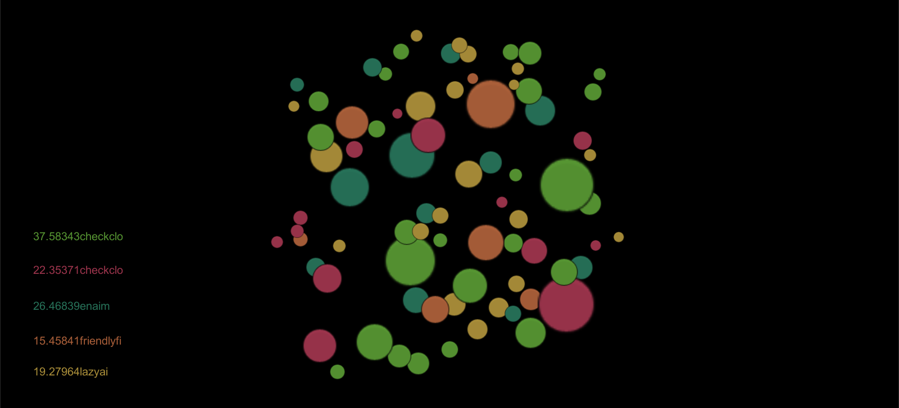
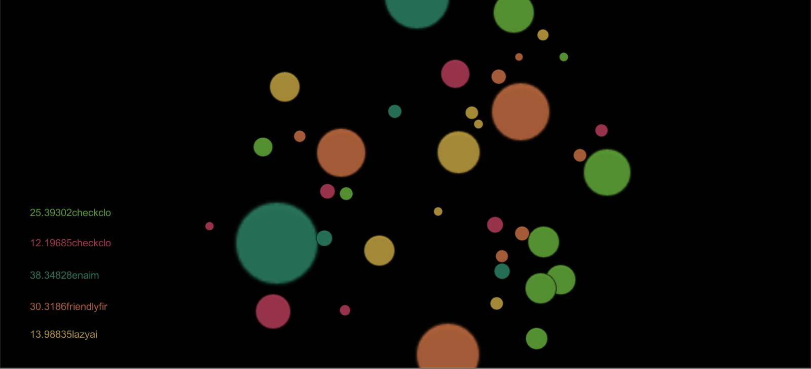
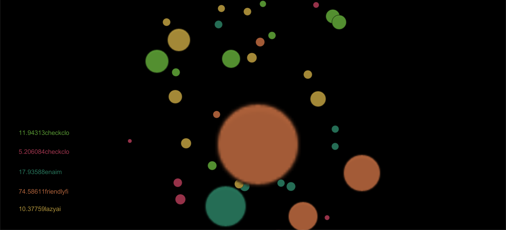
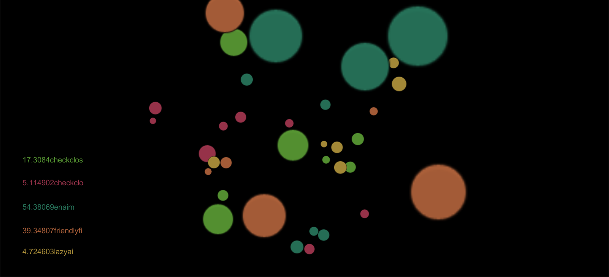

# agAIo - Evolving bots eating each other

We all love the online massive multiplayer game [agar.io](https://agar.io) where you need to grow your cell large by eating the cells of other players. This is a simulation where cells controlled by AIs play against each other, which emerges to a race between genomes (versions of code) loosely modeling natural selection. 

## Screenshots
The game is extremely easy and fun to play - just start the simulation and watch the colorful circles! :)

The labels on the left show the total mass for each colour-coded script.

## Details
Each cell is controlled by one of the few AI scripts we devised. New small cells pop up constantly and big cells have to eat small cells in order not to lose weight. Resorces (space and total mass of organisms) is limited so that versions of AI code will essentially have different fitness. The cells can split at any point in time, and at each split some characteristics of the cells (such as maximum speed or acceleration) evolve. Moreover, AIs can use the available information to identify nighboring cells as "friendly" (having the same code), thus are able to cooperate and spread their "genome" instead of ingesting each other. 

## Technology
The game mechanics are written in C#, using the Unity framework. AIs were written in Lua script. We used [MoonSharp](https://www.moonsharp.org), a Lua interpreter for Unity to hook the scripts into the game.

## Authors
Made at [HackCambridge Ternary](https://hackcambridge.com/), on 20-21 Jan 2018 by Team TungusGames.
Members:
Tamara Eszterhás
Péter Mernyei
Benedek Stadler
Tamás Tardos
